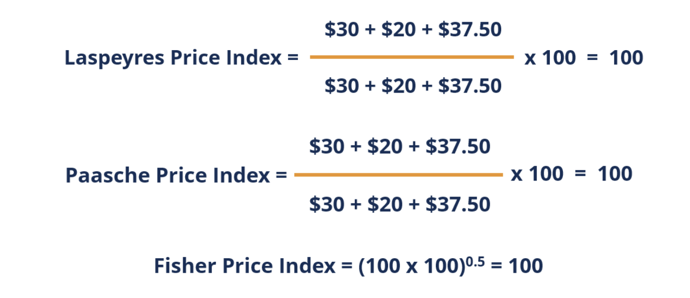
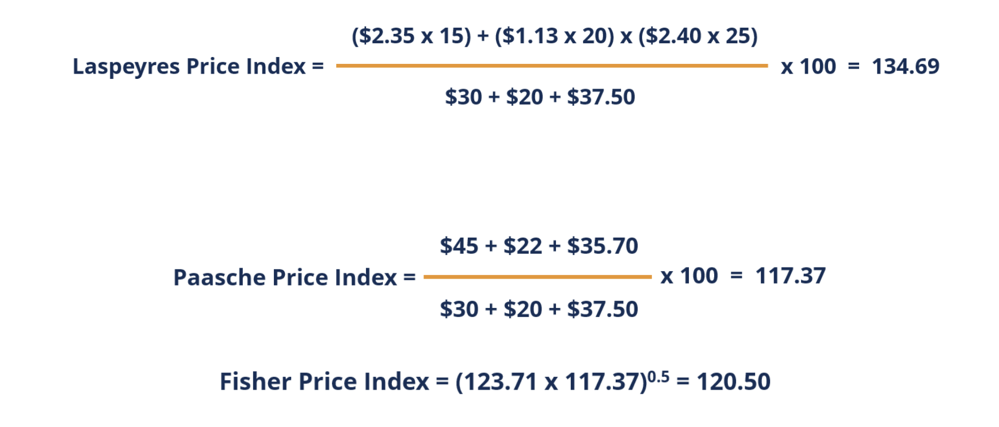
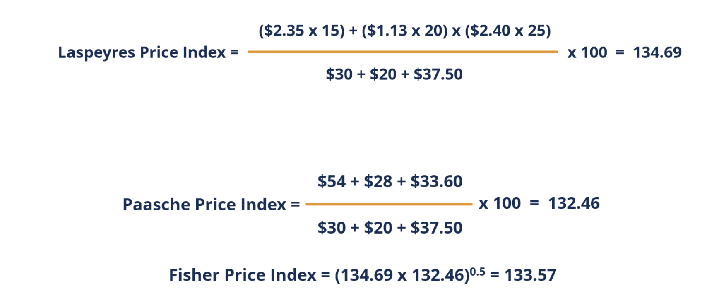

## Pregunta

¿Cómo considera en general la situación de nuestro país?

## Respuesta

¿En comparación a qué o dónde?

## ¿Qué son los Números Índices?

-   Son medidas estadísticas diseñadas para mostrar cambios en una variable o un grupo de variables a lo largo del tiempo o en comparación con una ubicación geográfica u otra categoría.
-   Se expresan generalmente en forma de porcentaje relativo a un período base o una ubicación base.
-   Simplifican la comparación de datos a través del tiempo o entre diferentes categorías.

## Usos de los Números Índices en Economía

-   Medir la inflación (Índice de Precios al Consumidor - IPC).
-   Analizar el crecimiento económico (Índice de Producción Industrial).
-   Evaluar el desempeño del mercado de valores (Índices Bursátiles).
-   Comparar el costo de vida entre regiones.

------------------------------------------------------------------------

## Elementos Clave de un Número Índice

1.  **Período Base:** El período de referencia con el cual se comparan los demás períodos. El valor del índice en el período base suele ser 100.
2.  **Período Actual (o de Comparación):** El período para el cual se calcula el número índice.
3.  **Valor(es) a Medir:** El precio, la cantidad, el valor, etc., que se está midiendo.

------------------------------------------------------------------------

## Tipos de Números Índices

1.  **Números Índices Simples:** Miden el cambio en una única variable.
2.  **Números Índices Agregados:** Miden el cambio promedio en un grupo de variables.

------------------------------------------------------------------------

## Número Índice Simple

Fórmula:

$$\text{Índice Simple} = \left( \frac{\text{Valor en el período actual}}{\text{Valor en el período base}} \right) \times 100$$

------------------------------------------------------------------------

## Ejemplo de Índice Simple (Precio)

Supongamos el precio de un bien en dos años:

| Año         | Precio (\$) |
|:------------|:------------|
| 2020 (Base) | 10          |
| 2023        | 12          |

El número índice simple para el precio en 2023 con base en 2020 es:

$$\text{Índice} = \left( \frac{12}{10} \right) \times 100 = 120$$

Interpretación: El precio del bien aumentó en un 20% entre 2020 y 2023.

------------------------------------------------------------------------

## Números Índices Agregados

Existen diferentes métodos para calcular índices agregados, considerando o no la importancia relativa de los elementos.

1.  **Índice Agregado Simple:** Suma de los precios/cantidades en el período actual dividida por la suma en el período base.
2.  **Índices Ponderados:** Asignan pesos a cada elemento según su importancia.

------------------------------------------------------------------------

## Índice Agregado Simple de Precios

Fórmula:

$$\text{Índice Agregado Simple} = \left( \frac{\sum P_{it}}{\sum P_{i0}} \right) \times 100$$

Donde: \* $P_{it}$ = Precio del artículo $i$ en el período $t$ (actual) \* $P_{i0}$ = Precio del artículo $i$ en el período 0 (base)

------------------------------------------------------------------------

## Ejemplo de Índice Agregado Simple de Precios

| Artículo | Precio 2022 (\$) | Precio 2024 (\$) |
|:---------|:----------------:|:----------------:|
| A        |        5         |        6         |
| B        |        10        |        12        |
| C        |        3         |        4         |
| **Suma** |      **18**      |      **22**      |

Índice Agregado Simple (base 2022):

$$\text{Índice} = \left( \frac{22}{18} \right) \times 100 \approx 122.22$$

## Ejemplo de Índice Agredado- cont:

Interpretación: Los precios promedio de estos artículos aumentaron aproximadamente en un 22.22% entre 2022 y 2024.

## Ejemplo Números Índice Producción

```{r}
#| echo: false
#| warning: false
library(dplyr)

ruta <- '/Users/josemiguelavendanoinfante/R/UCV_ECONOMIA_Stats/ucveconomiaestadistica1/data/indices.csv'
gt::gt(read.csv(ruta, 
                    sep = ';')%>%
  janitor:: clean_names())

```

## Ejemplo Números Índice Producción- Promedio o Imponderado

```{r}
gt::gt(read.csv(ruta, 
         sep = ';')%>%
  janitor:: clean_names()%>%
  as_data_frame()%>%
  select(1,3,5,7)%>%
  rowwise()%>%
  mutate(promedio= round(mean(c(rel, rel_1, rel_2)),0)))

```

------------------------------------------------------------------------

## Índices Ponderados de Precios

Consideran la importancia relativa de cada artículo, usualmente a través de las cantidades consumidas o producidas. Dos de los más comunes son:

1.  **Índice de Laspeyres:** Utiliza las cantidades del período base como ponderaciones.
2.  **Índice de Paasche:** Utiliza las cantidades del período actual como ponderaciones.

------------------------------------------------------------------------

## Índice de Laspeyres de Precios

Fórmula:

$$L_t = \left( \frac{\sum P_{it} Q_{i0}}{\sum P_{i0} Q_{i0}} \right) \times 100$$

Donde: \* $Q_{i0}$ = Cantidad del artículo $i$ en el período base.

------------------------------------------------------------------------

## Ejemplo de Índice de Laspeyres

| Artículo | $P_{i0}$ (2020) | $Q_{i0}$ (2020) | $P_{it}$ (2023) |
|:---------|:---------------:|:---------------:|:---------------:|
| X        |        2        |       10        |       2.5       |
| Y        |        5        |        5        |        6        |

Cálculo:

-   $\sum P_{i0} Q_{i0} = (2 \times 10) + (5 \times 5) = 20 + 25 = 45$
-   $\sum P_{it} Q_{i0} = (2.5 \times 10) + (6 \times 5) = 25 + 30 = 55$

$$L_{2023} = \left( \frac{55}{45} \right) \times 100 \approx 122.22$$

------------------------------------------------------------------------

## Índice de Paasche de Precios

Fórmula:

$$P_t = \left( \frac{\sum P_{it} Q_{it}}{\sum P_{i0} Q_{it}} \right) \times 100$$

Donde: \* $Q_{it}$ = Cantidad del artículo $i$ en el período actual.

------------------------------------------------------------------------

## Ejemplo de Índice de Paasche

| Artículo | $P_{i0}$ (2020) | $Q_{it}$ (2023) | $P_{it}$ (2023) |
|:---------|:---------------:|:---------------:|:---------------:|
| X        |        2        |       12        |       2.5       |
| Y        |        5        |        6        |        6        |

Cálculo:

-   $\sum P_{i0} Q_{it} = (2 \times 12) + (5 \times 6) = 24 + 30 = 54$
-   $\sum P_{it} Q_{it} = (2.5 \times 12) + (6 \times 6) = 30 + 36 = 66$

$$P_{2023} = \left( \frac{66}{54} \right) \times 100 \approx 122.22$$

*(En este ejemplo particular, coinciden, pero generalmente no es así)*

------------------------------------------------------------------------

## Índice de Fisher (o Índice Ideal)

Es la media geométrica de los índices de Laspeyres y Paasche. Se considera un índice más representativo.

Fórmula:

$$F_t = \sqrt{L_t \times P_t} = \sqrt{\left( \frac{\sum P_{it} Q_{i0}}{\sum P_{i0} Q_{i0}} \right) \times \left( \frac{\sum P_{it} Q_{it}}{\sum P_{i0} Q_{it}} \right)} \times 100$$

## Índice de Fisher /cont.

-   **Pi,t** es el precio del artículo individual en el período de observación

-   **Pi,0** es el precio del artículo individual en el período base

-   **Qi,t** es la cantidad del artículo individual en el período de observación

-   **Qi,0** es la cantidad del artículo individual en el período base

## Pasos Cálculo Índice de Fisher

-   **Paso 1:** Calcule el índice de precios de Laspeyres para cada período

-   **Paso 2:** Calcule el índice de precios de Paasche para cada período.

-   **Paso 3:** Tome el promedio geométrico del índice de precios de Laspeyres y Paasche en cada período

## Ejemplo: Cálculo I.F año base

```{r}
#| echo: false
per_0 <- data.frame(año_0=c("precio","cantidad",'valor'),
                    producto_a=c(2, 15, 30),
                    producto_b=c(1,20,20),
                    producto_c=c(1.5,25, 37.50)
                    )
per_1 <- data.frame(año_1=c("precio","cantidad",'valor'),
                    producto_a=c(2.25,20,45),
                    producto_b=c(1.10, 20,22),
                    producto_c=c(2.1,17,35.7)
)

per_2 <- data.frame(año_2=c("precio","cantidad",'valor'),
                    producto_a=c(2.35,23,54.05 ),
                    producto_b=c(1.13,25,28.25),
                    producto_c=c(2.4,14,33.6)
)

i_fis<- data.frame(comparativo=c("Laspeyres","Paasche",'Fischer'),
                    Base=c(100, 100, 100 ),
                    Año1=c(123.71, 117.31, 120.5),
                    Año2=c(134.69,132.46, 133.57)
)
gt::gt(per_0)
```

<br><br>

{fig-align="center" width="600"}


## Ejemplo: Cálculo I.F. año 1

```{r}
#| echo: false

gt::gt(per_1)

```

<br><br>

{fig-align="center" width="600"}

## Ejemplo: Cálculo I.F. año 2

```{r}
#| echo: false

gt::gt(per_2)

```

<br><br>

{fig-align="center" width="600"}

## Ejemplo: Cálculo I.F. Evolución

```{r}
#| echo: false
gt::gt(i_fis)
```

ejemplo y capturas de pantallas tomadas de <https://corporatefinanceinstitute.com/resources/economics/fisher-price-index/>

------------------------------------------------------------------------

## Aplicaciones Específicas en Economía

-   **Índice de Precios al Consumidor (IPC):** Mide la variación de los precios de una canasta de bienes y servicios consumidos por los hogares. Generalmente utiliza una metodología tipo Laspeyres (con revisiones periódicas de la canasta).
-   **Deflactor del PIB:** Un índice de precios que mide el nivel promedio de los precios de todos los bienes y servicios finales producidos en una economía.

------------------------------------------------------------------------

## Consideraciones al Usar Números Índices

-   **Selección del Período Base:** Debe ser un período "normal" o representativo.
-   **Selección de los Elementos:** Deben ser relevantes para lo que se quiere medir.
-   **Ponderaciones:** La elección de las ponderaciones afecta significativamente el resultado en los índices agregados.
-   **Comparabilidad a lo largo del tiempo:** Los cambios en la calidad de los bienes y servicios pueden ser difíciles de capturar.

## Ejemplos de Números Índices en Venezuela

https://www.bolsadecaracas.com

https://www.bcv.org.ve/estadisticas/consumidor

## Indíce Nacional de Precios al Consumidor BCV

```{r}
#| echo: false
#| warning: false
library(DT)
library(dplyr)
INPC <- readRDS('/Users/josemiguelavendanoinfante/R/UCV_ECONOMIA_Stats/ucveconomiaestadistica1/data/INPC.rds')

datatable(INPC%>%
            mutate(var2= round(var2,1),
                   indice=round(indice,0))%>%
            select(fecha_nva,indice,var2)%>%
            rename(variacion=var2,
                   índice= indice,
                   fecha= fecha_nva),
          options = list(
            dom = 'lrtip',
            pageLength = 4,
            autoWidth = FALSE,
            initComplete = JS(
              "function(settings, json) {",
              "$(this.api().table().header()).css({'background-color': '#053C5E','color': '#fff'});",
              "}"),
            rownames= FALSE,
            language = list(url = '//cdn.datatables.net/plug-ins/1.10.11/i18n/Spanish.json')#,
            ))


```
