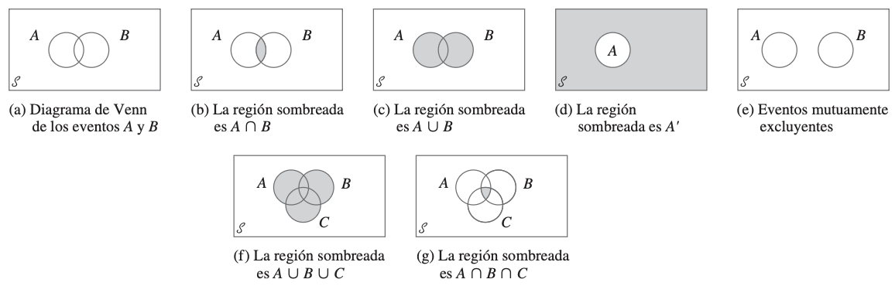

## 1. Teoría de Conjuntos

### Conceptos Clave

-   **Conjunto**: Una colección bien definida de objetos.
    -   Ej: $S = \{1, 2, 3, 4, 5, 6\}$ (resultados de un dado).
-   **Complemento (**$\mathbf{A^c}$ o $\mathbf{\bar{A}}$): Todos los elementos que no están en el conjunto A, pero sí en el espacio muestral.
    -   Ej: Si $A = \{2, 4, 6\}$ (pares), entonces $A^c = \{1, 3, 5\}$ (impares).

## 1. Teoría de Conjuntos- cont.

-   **Unión (**$\mathbf{A \cup B}$): Todos los elementos que están en A, o en B, o en ambos.
    -   Ej: Si $A = \{1, 2, 3\}$ y $B = \{3, 4, 5\}$, entonces $A \cup B = \{1, 2, 3, 4, 5\}$.
-   **Intersección (**$\mathbf{A \cap B}$): Todos los elementos que están tanto en A como en B.
    -   Ej: Si $A = \{1, 2, 3\}$ y $B = \{3, 4, 5\}$, entonces $A \cap B = \{3\}$.

## 2. Experimento y Espacio Muestral {.small}

### 2.1. Experimento

-   Cualquier proceso que produce un resultado observable.
-   **Características**:
    -   Se conoce el conjunto de todos los resultados posibles.
    -   No se puede predecir con certeza el resultado particular de una ejecución.
    -   Puede ser repetido bajo condiciones similares.
-   **Ejemplo**:
    -   Lanzar una moneda.
    -   Observar el tipo de cambio euro-dólar en un día específico.
    -   Contar el número de clientes que entran a un banco en una hora.

## 2.2. Espacio Muestral ($\mathbf{S}$ o $\mathbf{\Omega}$)

-   El conjunto de **todos los resultados posibles (puntos muestrales)** de un experimento.

-   **Ejemplos**:

    -   **Lanzar un dado**: $S = \{1, 2, 3, 4, 5, 6\}$
    -   **Lanzar dos monedas**: $S = \{\text{CC, CS, SC, SS}\}$
    -   **Tiempo de espera en una fila (en minutos)**: $S = \{t \mid t \ge 0\}$ (un espacio muestral continuo)

## 3. Eventos: Subconjuntos del Espacio Muestral {.small}

### 3.1. Definición de Evento

-   Un **evento** es cualquier **subconjunto** del espacio muestral. Es un resultado o un grupo de resultados de interés.

### 3.2. Tipos de Eventos

-   **Evento Simple (o Elemental)**: Un evento que consta de un solo resultado del espacio muestral.
    -   **Ejemplo**: Al lanzar un dado, el evento "obtener un 3" es simple: $E = \{3\}$.
-   **Evento Compuesto**: Un evento que consta de más de un resultado del espacio muestral.
    -   **Ejemplo**: Al lanzar un dado, el evento "obtener un número par" es compuesto: $E = \{2, 4, 6\}$.

## 4. Eventos desde la Perspectiva de Conjuntos

-   Dado que los eventos son subconjuntos del espacio muestral, podemos aplicar las operaciones de la teoría de conjuntos:

    -   **Unión de Eventos (**$\mathbf{A \cup B}$): Ocurre si el evento A ocurre, o el evento B ocurre, o ambos ocurren.
        -   Ej: Evento A = "Sacar un 1 o 2", Evento B = "Sacar un 2 o 3". $A \cup B$ = "Sacar 1, 2 o 3".

## 4. Eventos desde la Perspectiva de Conjuntos- cont.

-   **Intersección de Eventos (**$\mathbf{A \cap B}$): Ocurre si el evento A y el evento B ocurren simultáneamente.
    -   Ej: Evento A = "Sacar un número par", Evento B = "Sacar un número menor que 4". $A \cap B$ = "Sacar un 2".
-   **Complemento de un Evento (**$\mathbf{A^c}$): Ocurre si el evento A no ocurre.
    -   Ej: Evento A = "Sacar un número par". $A^c$ = "Sacar un número impar".

## Evento Nulo ($\mathbf{\emptyset}$ o {})

-   Un evento que **no contiene ningún resultado** del espacio muestral. Es un evento imposible.
    -   **Ejemplo**: Al lanzar un dado, el evento "obtener un 7" es el evento nulo.
    -   **Formalmente**: $A \cap A^c = \emptyset$.

## 5. Diagramas de Venn

-   Representaciones visuales de eventos y sus relaciones dentro de un espacio muestral.

    -   El espacio muestral ($S$) se representa como un rectángulo.
    -   Los eventos ($A, B, \dots$) se representan como círculos dentro del rectángulo.

## 5. Diagramas de Venn. Casos

{fig-align="center"}

## 5. Diagramas de Venn- Ejemplos

-   **Evento A:**

    ```         
    +-------------------+
    | S                 |
    |    +-------+      |
    |    |   A   |      |
    |    |       |      |
    |    +-------+      |
    |                   |
    +-------------------+
    ```

## 5. Diagramas de Venn- Ejemplos

-   **A Complemento (**$A^c$): (Área fuera de A)

    ```         
    +-------------------+
    | S     +-------+   |
    |       |       |   |
    |#######| A     |###|
    |#######|       |###|
    |#######+-------+###|
    |###################|
    +-------------------+
    (El área sombreada es A^c)
    ```

## 5. Diagramas de Venn- Ejemplos

-   **Unión (**$\mathbf{A \cup B}$): (Área de A, B, o ambos)

    ```         
    +-------------------+
    | S                 |
    |    +-------+      |
    |    | A     |      |
    |    |     +-----+  |
    |    +-----+ B   |  |
    |          |     |  |
    |          +-----+  |
    |                   |
    +-------------------+
    (Las áreas combinadas de A y B)
    ```

## 5. Diagramas de Venn- Ejemplos

-   **Intersección (**$\mathbf{A \cap B}$): (Área donde A y B se superponen)

    ```         
    +-------------------+
    | S                 |
    |    +-------+      |
    |    | A     |      |
    |    |   ### | B    |
    |    +-----+ ### +  |
    |          | ### |  |
    |          +-----+  |
    |                   |
    +-------------------+
    (El área sombreada es A intersección B)
    ```

## 6. Axiomas de la Probabilidad

-   Fundamentos matemáticos sobre los cuales se construye la teoría de la probabilidad.

### Axioma 1: No Negatividad

-   Para cualquier evento A, la probabilidad de A es no negativa: $$P(A) \ge 0$$
-   **Ejemplo**: La probabilidad de que llueva mañana no puede ser $-0.2$. Siempre será un valor igual o mayor que cero.

## 6. Axiomas de la Probabilidad

### Axioma 2: Probabilidad del Espacio Muestral

-   La probabilidad del espacio muestral completo es igual a 1. $$P(S) = 1$$
-   **Ejemplo**: Si lanzamos una moneda, la probabilidad de que salga "cara" o "sello" es 1, ya que cubre todos los resultados posibles.

## 6. Axiomas de la Probabilidad

### Axioma 3: Aditividad para Eventos Mutuamente Excluyentes

-   Si A y B son eventos **mutuamente excluyentes** (es decir, no pueden ocurrir al mismo tiempo, $A \cap B = \emptyset$), entonces la probabilidad de su unión es la suma de sus probabilidades individuales: $$P(A \cup B) = P(A) + P(B) \quad \text{si } A \cap B = \emptyset$$

## Axioma 3: Aditividad para Eventos Mutuamente Excluyentes- cont.

-   **Ejemplo**:

Si en un dado, A = "sacar un número par" ($\{2,4,6\}$) y B = "sacar un 1" ($\1/6\}$).

Son mutuamente excluyentes.

-   $P(A) = 3/6 = 1/2$
-   $P(B) = 1/6$
-   $P(A \cup B) = P(\text{sacar un par o un 1}) = P(\{1,2,4,6\}) = 4/6 = 2/3$.
-   Verificamos: $P(A) + P(B) = 1/2 + 1/6 = 3/6 + 1/6 = 4/6 = 2/3$.

## 7. Proposiciones Clave de la Probabilidad

### 7.1. Probabilidad del Complemento

-   Para cualquier evento A, la probabilidad de A más la probabilidad de su complemento es 1. $$P(A) + P(A^c) = 1$$
-   De esto se deriva que: $$P(A^c) = 1 - P(A)$$

## 7.1. Probabilidad del Complemento. Ejemplo

-   **Ejemplo**: Si la probabilidad de que un proyecto tenga éxito ($A$) es $P(A) = 0.7$, entonces la probabilidad de que no tenga éxito ($A^c$) es $P(A^c) = 1 - 0.7 = 0.3$.

## 7. Proposiciones Clave de la Probabilidad

### 7.2. Límite Superior de la Probabilidad

-   Para cualquier evento A, la probabilidad de A es menor o igual a 1. (Esto se desprende del Axioma 1 y Axioma 2, ya que $P(A) \le P(S) = 1$). $$P(A) \le 1$$
-   **Ejemplo**: La probabilidad de que un evento ocurra nunca puede ser mayor al 100%.

## 7. Proposiciones Clave de la Probabilidad {.small}

### 7.3. Regla de Adición para Dos Eventos

-   Para dos eventos cualesquiera A y B (sean mutuamente excluyentes o no): $$P(A \cup B) = P(A) + P(B) - P(A \cap B)$$
-   **Ejemplo**:
    -   Evento A: Estudiante aprueba Macroeconomía ($P(A) = 0.6$).
    -   Evento B: Estudiante aprueba Microeconomía ($P(B) = 0.5$).
    -   Evento $A \cap B$: Estudiante aprueba ambas ($P(A \cap B) = 0.3$).
    -   Probabilidad de aprobar al menos una: $P(A \cup B) = 0.6 + 0.5 - 0.3 = 0.8$.

## 7. Proposiciones Clave de la Probabilidad {.small}

### 7.4. Regla de Adición para Tres Eventos

-   Para tres eventos cualesquiera A, B y C: $$P(A \cup B \cup C) = $$ <br> $$P(A) + P(B) + P(C) - P(A \cap B) - P(A \cap C) - P(B \cap C) + P(A \cap B \cap C)$$
-   Esta fórmula generaliza la regla de adición, asegurando que las intersecciones se resten adecuadamente para evitar el doble conteo de resultados.
