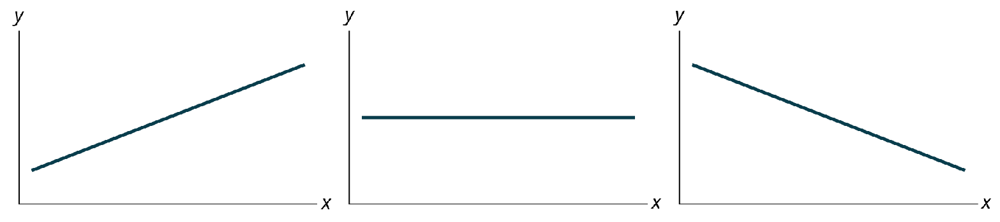
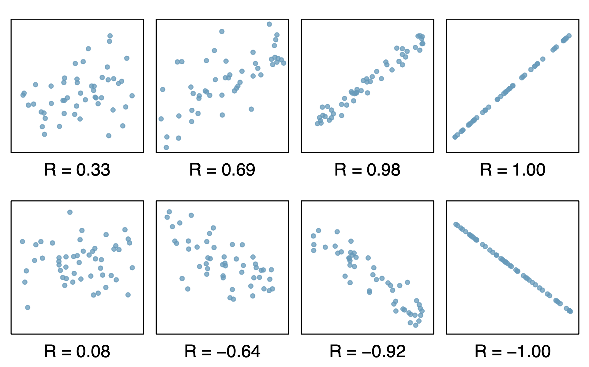
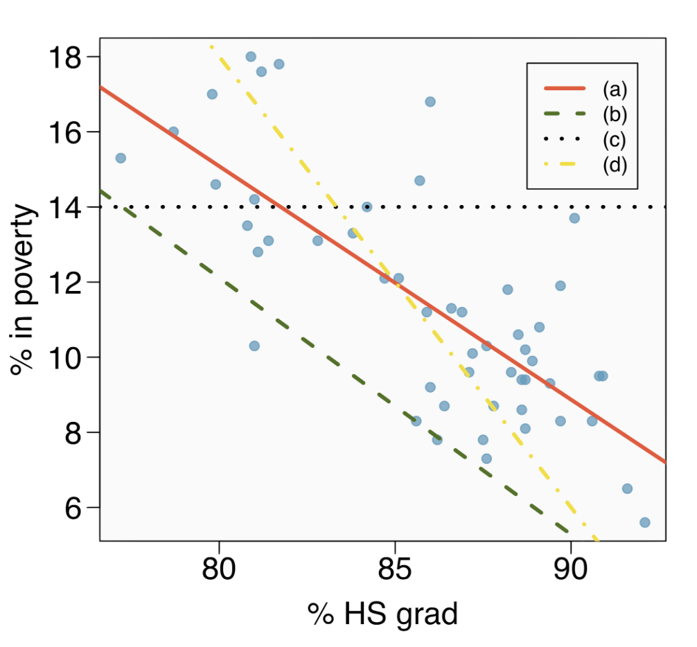
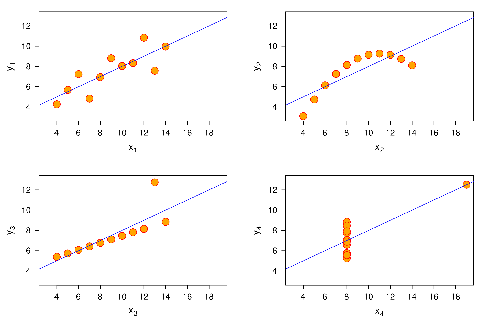

## Repaso {.small style=".small"}

**Ecuaciones:** afirmaciones matemáticas que establecen una igualdad entre dos expresiones. Ejemplo $y = c + mx$

Siendo $c = 10$ y $m=1$ se puede representar la recta de la ecuación anterior

```{r}
#| echo: false
#| warning: false

library(tidyverse)
library(knitr)
m <- 1  # Pendiente
c <- 10  # Intercepto

# Define el rango de valores para x
x_min <- 0
x_max <- 20

# Crea un data frame con los valores de x dentro del rango
df <- data.frame(x = seq(x_min, x_max, length.out = 10))

# Calcula los valores de y correspondientes
df$y <- m * df$x + c

df <- df%>%
  mutate(x=round(x,2),
         y=round(y,2))

# Crea el gráfico con ggplot2
ggplot(df, aes(x = x, y = y)) +
  geom_line(color='#c1121f', linewidth=3) +             # Dibuja la línea
  theme_bw() +
    scale_y_continuous(limits = c(0, 30)) # Define los límites del eje x


```

## Representaciones de Ecuaciones Lineales Según la Pendiente

Siendo $m$ la pendiente tenemos

{fig-align="center"}

Pendiente positiva $m>0$ ➡️ ***línea creciente***

Pendiente cero $m=0$ ➡️ ***línea paralela al eje de las*** $x$

Pendiente negativa $m<0$ ➡️ ***línea decreciente***

## Observaciones

En un conjunto de datos una observación es una única medición que se registra para una o varias características específicas de un elemento o entidad.

#### Ejemplo Conjunto de Datos `Cars`

```{r}
#| echo: false

kable(head(cars,4))

```

## Gráficos de Dispersión

Para dos variables (bivariable) `speed` y `dist` se hace la representación de un gráfico de dispersión

```{r}
#| echo: false

ggplot(data=cars, aes(x=speed,y= dist))+
  geom_point(color='#c1121f')+
  labs(title = "Conjunto Cars: Velocidad ~ Distancia",
       x = "velocidad",
       y = "distancia") +
  theme_bw()
  
```

## Encontrar la Línea

Queremos encontrar una función que pueda explicar una relación que parecieran tener las variables

```{r}
#| echo: false

ggplot(data=cars, aes(x=speed,y= dist))+
  geom_point(color='#c1121f')+
  # stat_summary(fun.data=mean_cl_normal) + 
  geom_smooth(method='lm', formula= y~x, se= FALSE)+
  labs(title = "Conjunto Cars: Velocidad ~ Distancia",
       x = "velocidad",
       y = "distancia") +
  theme_bw()
```

## Relaciones (curvas) que No Estudiaremos

```{r}
#| echo: false
df_exp <- data.frame(x=1:30)%>%
  mutate(y=x^5.7)%>%
  mutate(z=runif(y,y*0.7,y*1.2 ))


ggplot(data=df_exp, aes(x=x,y= y))+
  #geom_line(color='#c1121f', linewidth=3)+
  geom_point(aes(y=z),color='blue', size=2)
```

## Ejemplo de Ajuste de Curva (no abordado)

```{r}
#| echo: false

ggplot(data=df_exp, aes(x=x,y= y))+
  geom_line(color='#c1121f', linewidth=3)+
  geom_point(aes(y=z),color='blue', size=2)
```

## ¿Para qué queremos una función que permita el ajuste?

-   Explicar las relaciones matemáticamente

-   **Prededir**

### Relaciones Causales:

-   el que dos variables muestren asociación, no implica causación

-   buscar determinar cuál es la causa y cuál es el efecto

## Correlaciones

La **correlación** examina cómo se relacionan linealmente dos variables cuantitativas. Su **fuerza** (débil o fuerte) y su **dirección** (positiva o negativa) se miden con un coeficiente, el cual evalúa el grado en que los puntos de datos se aproximan a una línea recta.

## **Coeficiente de Correlación (de Pearson):**

El **coeficiente de correlación de Pearson** (ρ para la población y r para la muestra) es una medida estadística que cuantifica la **fuerza** y la **dirección** de la relación lineal entre dos variables cuantitativas.

Indica en qué medida los cambios en una variable están asociados con cambios proporcionales en la otra.

## **Rango del Coeficiente de Correlación:**

El coeficiente de correlación de Pearson siempre toma un valor entre **-1 y +1**, inclusive:

$$−1≤r≤+1$$

El signo de $r$ es el mismo de la pendiente

## Tabla de Interpretación de Coeficientes {style=".small"}

| Rango r | **Interpretación de la Correlación** |
|:---------------|:----------------------------------------------------|
| r=+1 | Correlación positiva perfecta. Los puntos se alinean perfectamente en una línea recta ascendente. |
| 0.7≤r\<1 | Correlación positiva fuerte. Los puntos tienden a agruparse cerca de una línea recta ascendente. |
| 0.3≤r\<0.7 | Correlación positiva moderada. Se observa una tendencia ascendente, pero con más dispersión. |

## Tabla de Interpretación de Coeficientes {style=".small"}

| **Rango r** | **Interpretación de la Correlación** |
|:-----------------|:---------------------------------------------------|
| 0\<r\<0.3 | Correlación positiva débil. Ligera tendencia ascendente, mucha dispersión. |
| r=0 | No hay correlación lineal. Las variables no muestran una relación lineal aparente. |
| −0.3\<r\<0 | Correlación negativa débil. Ligera tendencia descendente, mucha dispersión. |

## Tabla de Interpretación de Coeficientes {style=".small"}

| **Rango r** | **Interpretación de la Correlación** |
|:-------------------|:--------------------------------------------------|
| −0.7\<r≤−0.3 | Correlación negativa moderada. Se observa una tendencia descendente, pero con más dispersión. |
| −1\<r≤−0.7 | Correlación negativa fuerte. Los puntos tienden a agruparse cerca de una línea recta descendente. |
| r=−1 | Correlación negativa perfecta. Los puntos se alinean perfectamente en una línea recta descendente. |

## Ejemplos de Coeficientes de Correlación

{width="900"}

# Ejercicios

## 1 ¿Cuál línea se Adapta Mejor?

{fig-align="center" width="700"}

## 2. Cuarteto de Anscombe

{fig-align="center" width="900"}

más info en <https://es.wikipedia.org/wiki/Cuarteto_de_Anscombe>


