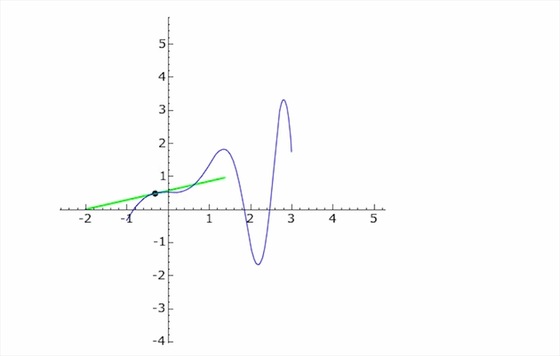

## Introducción a la Regresión Lineal Simple

-   La **regresión lineal simple** busca modelar la relación lineal entre una variable dependiente ($Y$) y una variable independiente ($X$).
-   El objetivo es encontrar la "mejor" línea recta que describa cómo cambia $Y$ en función de $X$, equivalente a predecir el valor de la variable dependiente basándose en el valor de la variable independiente.

Esta línea se representa con la ecuación: $$\hat{y} = \beta_0 + \beta_1 x$$

## Compuesta por

El modelo de R.L.S., $\hat{y} = \beta_0 + \beta_1 x$ , está compuesto por

-   $\hat{y}$ es el valor predicho de $Y$,

-   $\beta_0$ es la intersección con el eje $Y$, y

-   $\beta_1$ es la pendiente.

## Regresión Lineal Simple en la Economía

Entender cómo cambios en una variable (ej. inversión) afectan a otra (ej. crecimiento del PIB).

## Modelo de Regresión Lineal Simple {.small}

-   **Ecuación:** La relación lineal se representa mediante la siguiente ecuación:

    $$Y_i = \beta_0 + \beta_1 X_i + \epsilon_i$$

    Donde:

    -   $Y_i$: Es el valor observado de la variable dependiente para la observación $i$.
    -   $X_i$: Es el valor observado de la variable independiente para la observación $i$.
    -   $\beta_0$: Es el **intercepto** (o constante), que representa el valor esperado de $Y$ cuando $X$ es 0.
    -   $\beta_1$: Es la **pendiente**, que representa el cambio promedio en $Y$ por cada unidad de cambio en $X$.
    -   $\epsilon_i$: Es el **término de error** (o residual), que captura la variación en $Y$ no explicada por $X$ y otros factores no observados.

## Interpretación de los Coeficientes {.small}

-   $\beta_0$ (Intercepto):
    -   **Lectura:** "Cuando la variable independiente ($X$) es cero, el valor esperado de la variable dependiente ($Y$) es $\beta_0$."
    -   **Consideraciones:** No siempre tiene una interpretación práctica significativa, especialmente si $X=0$ no es un valor posible o relevante en el contexto.
-   $\beta_1$ (Pendiente):
    -   **Lectura:** "Por cada aumento de una unidad en la variable independiente ($X$), se espera que la variable dependiente ($Y$) cambie en $\beta_1$ unidades, manteniendo todo lo demás constante."
    -   **Signo:**
        -   Si $\beta_1 > 0$: Relación positiva (aumenta $X$, aumenta $Y$).
        -   Si $\beta_1 < 0$: Relación negativa (aumenta $X$, disminuye $Y$).
        -   Si $\beta_1 \approx 0$: No hay relación lineal.

## El Método de Mínimos Cuadrados

-   El método de **mínimos cuadrados** se utiliza para encontrar los valores de $\beta_0$ y $\beta_1$ que hacen que la línea de regresión se ajuste lo mejor posible a los datos observados.
-   "Lo mejor posible" se define como minimizar la suma de los cuadrados de las diferencias verticales entre los valores reales de $Y$ y los valores predichos $\hat{y}$. Estas diferencias se llaman **errores** o **residuos**.

## El Método de Mínimos Cuadrados-cont. {.small}

Queremos minimizar <br><br>

$\sum_{i=1}^{n} (y_i - \hat{y}_i)^2$ que es el error cuadrático medio

dado que = $$\hat{Y}_i = \hat{\beta}_0 + \hat{\beta}_1 X_i$$

entonces: <br> $$\sum_{i=1}^{n} (y_i - \hat{y}_i)^2=\sum_{i=1}^{n} (y_i - (\hat{\beta}_0 + \hat{\beta}_1 X_i))^2$$

Donde:  

-   $\hat{Y}_i$: Es el valor predicho de $Y$ para una $X_i$ dada.  

-   $\hat{\beta}_0$: Es la estimación del intercepto.  

-   $\hat{\beta}_1$: Es la estimación de la pendiente.

::: notes
usar aplicación y ver errores
:::

## Fórmulas para el Cálculo de los Coeficientes(Mínimos Cuadrados) {.small}

Las fórmulas para calcular la pendiente ($beta_1$) y la intersección ($beta_0$) que minimizan la suma de los cuadrados de los errores son:

**Estimación de la Pendiente (**$\hat{\beta}_1$):

$$\hat{\beta}_1 = \frac{\sum_{i=1}^{n}(X_i - \bar{X})(Y_i - \bar{Y})}{\sum_{i=1}^{n}(X_i - \bar{X})^2}$$

O su forma equivalente:

$$\hat{\beta}_1 = \frac{n \sum_{i=1}^{n} X_i Y_i - (\sum_{i=1}^{n} X_i)(\sum_{i=1}^{n} Y_i)}{n \sum_{i=1}^{n} X_i^2 - (\sum_{i=1}^{n} X_i)^2}$$

Donde:

-   $\bar{X}$: Media de $X$.

-   $\bar{Y}$: Media de $Y$.

-   $n$: Número de observaciones.

## Fórmulas para el Cálculo de los Coeficientes (Mínimos Cuadrados)-cont.

-   **Estimación del Intercepto (**$\hat{\beta}_0$):

    $$\hat{\beta}_0 = \bar{Y} - \hat{\beta}_1 \bar{X}$$

## Mínimo de $\sum_{i=1}^{n} (y_i - \hat{y}_i)^2$ por Derivada

{fig-align="center"}

## Lectura de un Resultado de Regresión

-   **Ejemplo :** Supongamos que regresamos "Gasto en Consumo ($Y$)" sobre "Ingreso Disponible ($X$)" y obtenemos:

    $$\text{Gasto en Consumo} = 100 + 0.75 \times \text{Ingreso Disponible}$$

-   **Interpretación:**

    -   **Intercepto (100):** Si el ingreso disponible es cero (situación hipotética), el gasto en consumo estimado es de 100 unidades monetarias.
    -   **Pendiente (0.75):** Por cada aumento de una unidad monetaria en el ingreso disponible, se espera que el gasto en consumo aumente en 0.75 unidades monetarias, en promedio. Esto también puede interpretarse como que el 75% de cada unidad monetaria adicional de ingreso se destina al consumo (Propensión Marginal a Consumir).

## Ejemplo de Cálculo

Consideremos los siguientes datos sobre el número de horas dedicadas a un proyecto ($X$) y la calificación obtenida ($Y$):

| Estudiante | Horas ($X$) | Calificación ($Y$) |
|:----------:|:-----------:|:------------------:|
|     1      |      1      |         2          |
|     2      |      2      |         4          |
|     3      |      3      |         5          |

Nuestro objetivo es encontrar la línea de regresión lineal que mejor se ajuste a estos puntos.

## Gráfico de Dispersión

```{r}
#| echo: false
#| warning: false

x <- c(1,2,3)
y <- c(2,4,5)
plot(x,y,col='blue', 
     pch=8,
     cex=4,
     main='Horas de Estudio Vs. Calificación',
     xlab= 'horas',
     ylab='calificación')


```

------------------------------------------------------------------------

## Cálculo de $beta_1$ y $beta_0$

Primero, calculamos las medias:

<br><br>

$\bar{x} = \frac{1 + 2 + 3}{3} = 2$

<br><br>

$\bar{y} = \frac{2+4+5}{3} = \frac{11}{3} \approx 3.67$

## Cálculo de $\beta_1$ y $\beta_0$ - cont:

Ahora, calculamos los términos necesarios para $\beta_1$:

<br>

| $x_i$ | $y_i$ | $x_i - \bar{x}$ | $y_i - \bar{y}$ | $(x_i - \bar{x})(y_i - \bar{y})$ | $(x_i - \bar{x})^2$ |
|:------:|:------:|:------:|:------:|:------:|:------:|
| 1 | 2 | -1 | -1.67 | 1.67 | 1 |
| 2 | 4 | 0 | 0.33 | 0 | 0 |
| 3 | 5 | 1 | 1.33 | 1.33 | 1 |
|  |  |  |  | $\sum = 3.00$ | $\sum = 2$ |

## Cálculo de $\beta_1$ y $\beta_0$ - cont:

Calculamos $\beta_1$: $$\beta_1 = \frac{3.00}{2} = 1.5$$

Ahora, calculamos $\beta_0$: $$\beta_0 = \bar{y} - \beta_1 \bar{x} = 3.67 - (1.5)(2) = 3.67 - 3 = 0.67$$

------------------------------------------------------------------------

## La Línea de Regresión

La ecuación de la línea de regresión lineal obtenida por el método de mínimos cuadrados es:

$$\hat{y} = 0.67 + 1.5 x$$

Esta ecuación nos permite predecir la calificación ($\hat{y}$) dado el número de horas dedicadas al proyecto ($x$), basándonos en el modelo lineal ajustado a nuestros datos.

## Usos de la RL

-   Evaluar relaciones entre dos variables
-   Predecir
